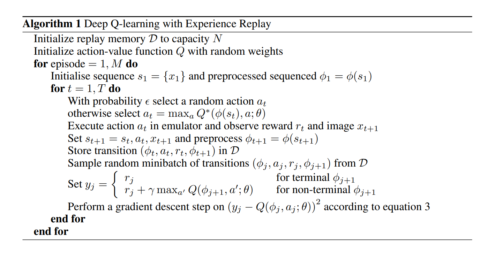

# Smart Trading Bot 🤖 📈
This code implements algorithms for automatically fetching historical trading data, using it to train a reinforcement
learning agent, and then executing trades on a platform.

## Currently supporting
 - DQN Agent with experience replay and target networks.
 - Yahoo Finance integration for pulling daily stock and cryptocurrency prices.
 - Binance integration for cryptocurrency trading (coming soon).
 - Distributed training for training speedup (coming soon).

## Contributing
I am open to open source contributions. Please follow the CONTRIBUTING guidelines.
A good place to start is by looking at the issues page and assigning yourself to an available issue.
Please reach out for guidance. This is meant to be a fun practical project, so don't take it too seriously!

## NOTE
Please ensure you understand the code license before using in a production environment.

### References
- [Playing Atari with Deep Reinforcement Learning](https://arxiv.org/abs/1312.5602)
- [Prioritized Experience Replay](https://arxiv.org/abs/1511.05952)
- [Trading Bot](https://github.com/pskrunner14/trading-bot)
